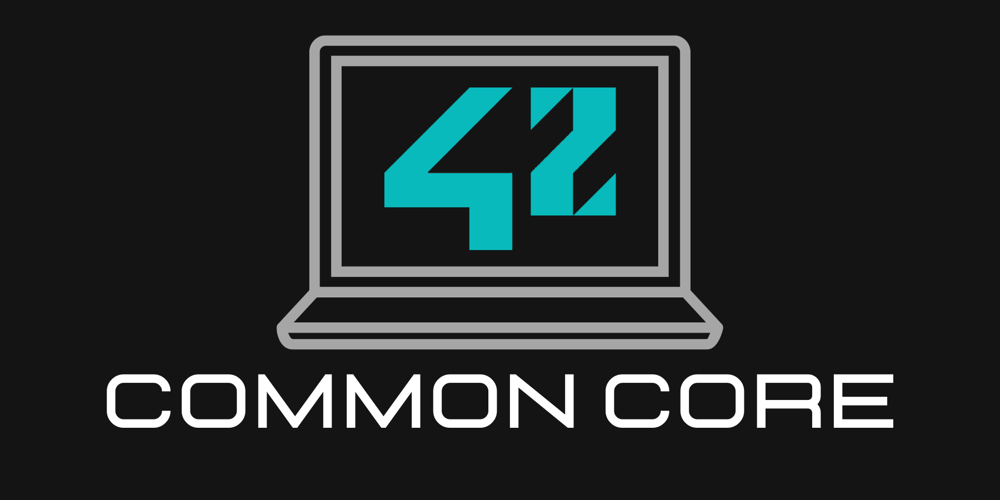

 

# 42 School Common Core

Mon parcours au Cursus commun de l'école 42 Lausanne.

## Projects

### Cercle 0
- [Libft](./0-libft/)

 

---

### Cercle 1
- [Get_next_line](./1-get_next_line/)
- [Born2beroot](./1-born2beroot/)
- [Ft_printf](./1-ft_printf/)

 

---

### Cercle 2
- [Push_swap](./2-push_swap/)
- [Minitalk](./2-minitalk/) (waiting for evaluation)
- [So_long](./2-so_long/) (in progress)
- [Exam Rank 02](https://github.com/aceyzz/42-Exam/tree/master/exam_rank_02)

 

---

### Cercle 3
- ~~Minishell~~
- ~~Philosophers~~
- ~~Exam Rank 03~~

 

---

### Cercle 4
- ~~Cub3d~~
- ~~NetPractice~~
- ~~Modules CPP (00 to 04)~~
- ~~Exam Rank 04~~

 

---

### Cercle 5
- ~~Webserv / Ft_irc~~
- ~~Inception~~
- ~~Modules CPP (05 to 09)~~
- ~~Exam Rank 05~~

 

---

### Cercle 6
- ~~Ft_transcendance~~
- ~~Exam Rank 06~~
