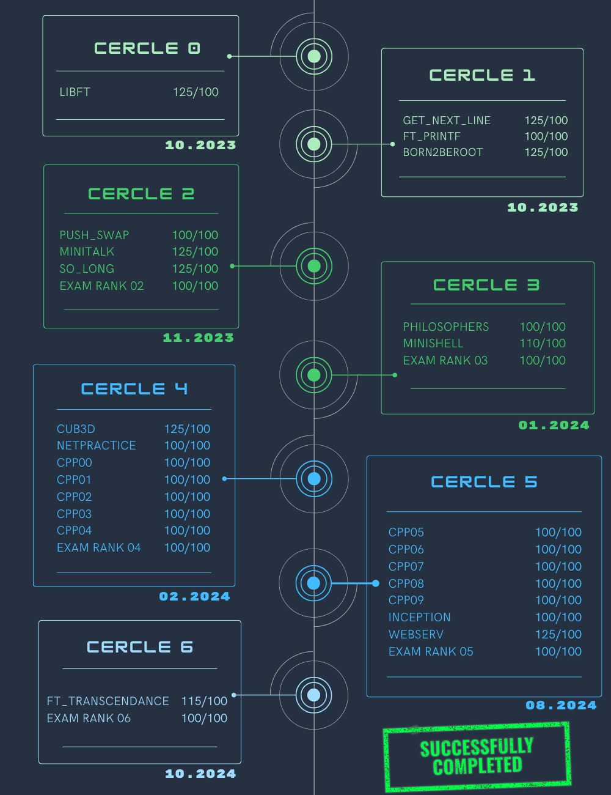

 

---

 

## Projects

### Cercle 0

- [Libft](https://github.com/aceyzz/Libft) ✅

 

---

### Cercle 1

- [Get_next_line](https://github.com/aceyzz/Get_next_line) ✅
- [Born2beroot](https://github.com/aceyzz/Born2beRoot) ✅
- [Ft_printf](https://github.com/aceyzz/Ft_printf) ✅

 

---

### Cercle 2

- [Push_swap](https://github.com/aceyzz/Push_swap) ✅
- [Minitalk](https://github.com/aceyzz/Minitalk) ✅
- [So_long](https://github.com/aceyzz/So_long) ✅
- [Exam Rank 02](https://github.com/aceyzz/42-Exam/tree/master/exam_rank_02) ✅

 

---

### Cercle 3

- [Philosophers](https://github.com/aceyzz/Philosophers) ✅
- [Minishell](https://github.com/aceyzz/Minishell) ✅
- [Exam Rank 03](https://github.com/aceyzz/42-Exam/tree/master/exam_rank_03) ✅

 

---

### Cercle 4

- [Cub3d](https://github.com/aceyzz/cub3d) (In progress...) ⌛
- NetPractice
- Modules CPP 00
- Modules CPP 01
- Modules CPP 02
- Modules CPP 03
- Modules CPP 04
- Exam Rank 04

 

---

### Cercle 5 *(locked)*

- ~~Webserv / Ft_irc~~
- ~~Inception~~
- ~~Modules CPP 05~~
- ~~Modules CPP 06~~
- ~~Modules CPP 07~~
- ~~Modules CPP 08~~
- ~~Modules CPP 09~~
- ~~Exam Rank 05~~

 

---

### Cercle 6 *(locked)*

- ~~Ft_transcendance~~
- ~~Exam Rank 06~~

 

